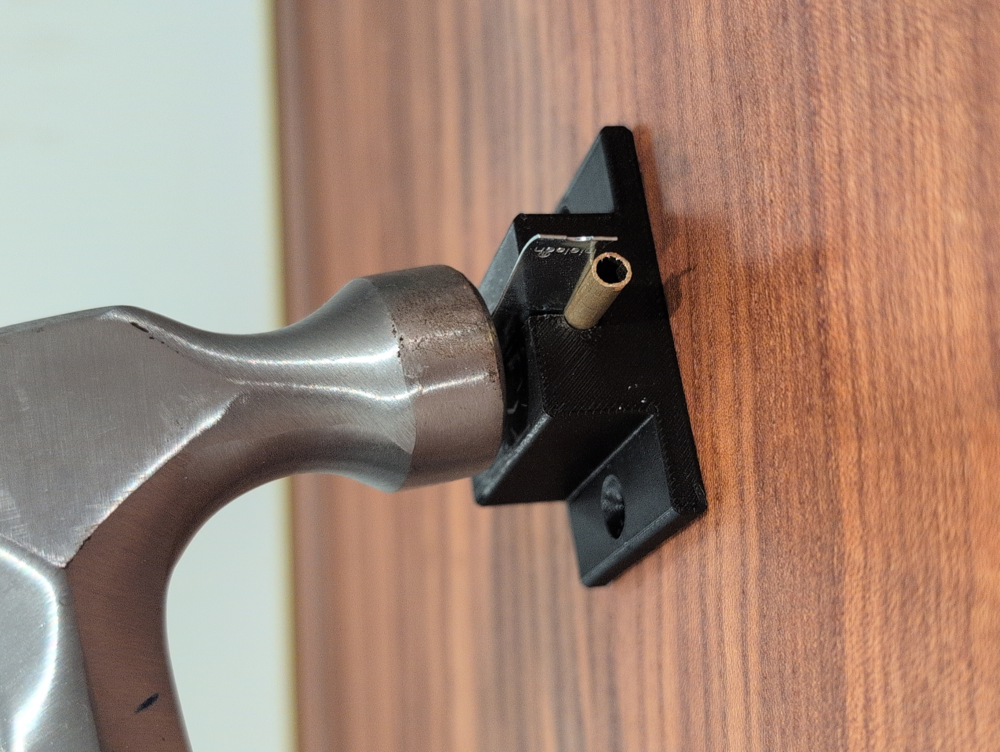
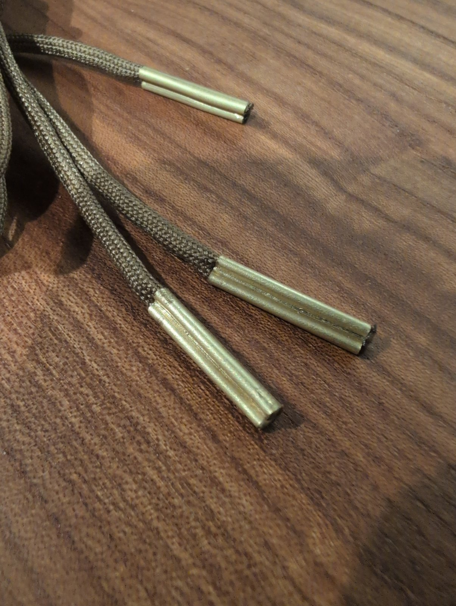
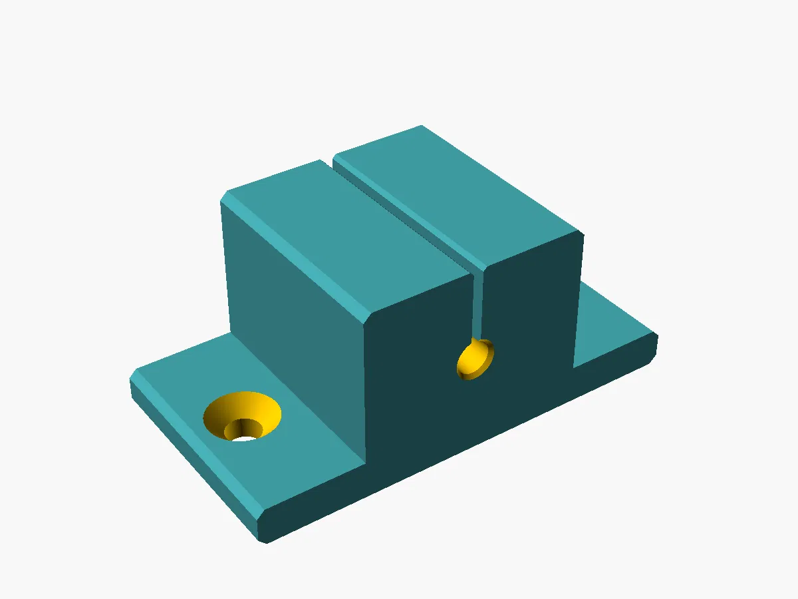
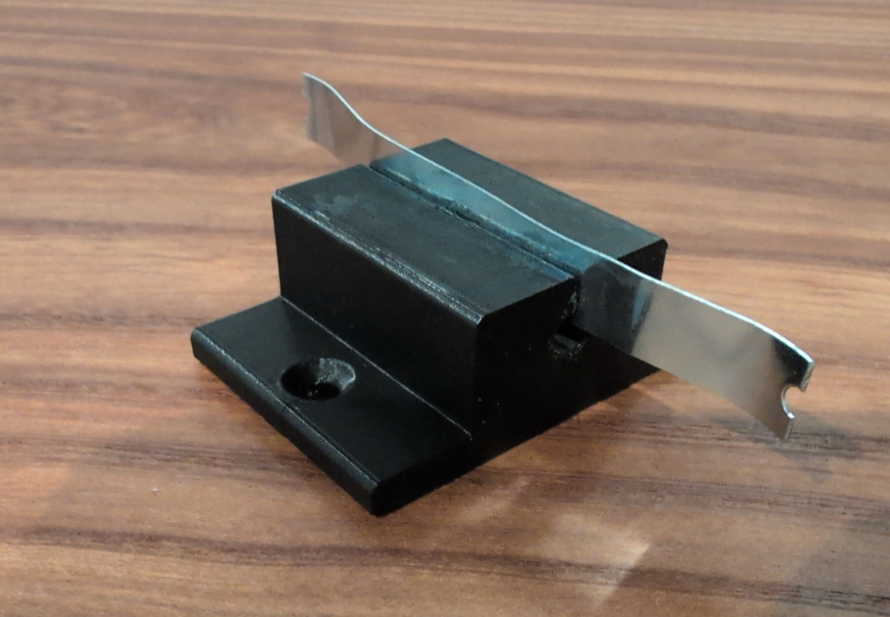
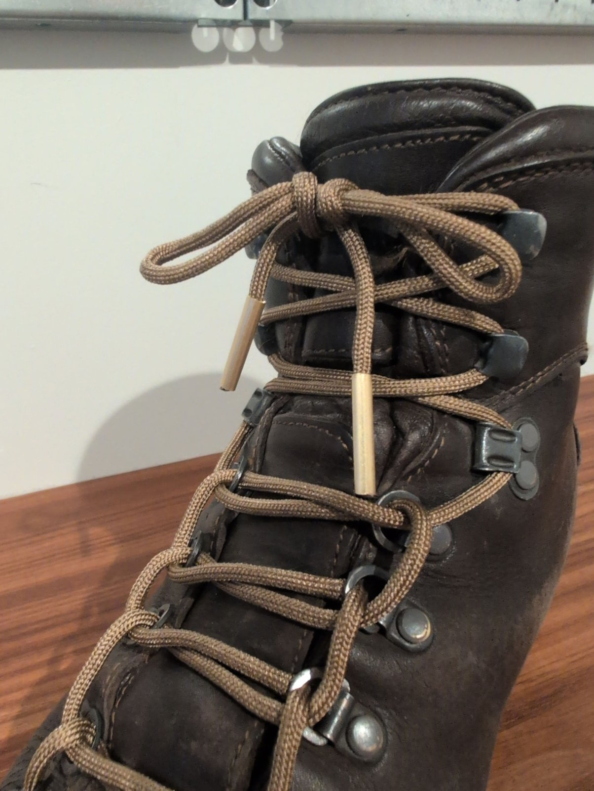

# Aglet Crimping Anvil

Parametric crimping anvil for making metal-tubing shoelace aglets, based on the custom aglet crimping anvil on Ian Fieggen's Shoelace Site: https://www.fieggen.com/shoelace/agletmetal.htm

  
  

Slide brass, copper or aluminium tubing over the lace end, feed it into the hole, set a thin steel strip (the "chisel") in the slot, and tap it gently with a hammer to crimp the tube lengthwise onto the lace.

Customizable: tubing diameter and hole clearance, chisel thickness and slot clearance, slot depth, block size, and an optional bench-mounting flange with countersinks for #8 or M4 flat-head screws. Defaults: 5.0 mm tubing, 0.45 mm chisel, 5 mm slot depth, and a 40 × 30 × 20 mm block (length × width × height).

  
  

Customize in your browser: [open the model in OpenSCAD Playground](https://ochafik.com/openscad2/#H4sIAAAAAAAAA42Qu2rDQBBF/+Wm1QOcImS7QEgRXKQPxkxWI2lhX+zOyrGE/j1IxkWakG64nDkz3AWRErkMtYC0mIk/SEYotDRYlrNOxkXjhzP5ydgma+pQIYeSNGeozwXxH3xJFgqjSMyqbRNdmsHIWL5K5qSDF/bS6ODaFy/vxxB5vtnqu63eba0j4/+4s54q9ExS0v4aLM3XungTPE4V+DuGJG8hOZLDKxTyNOB3/LjHYrFWmAxftlIsXUORbXKhYyi4YsVsi52RkKB6splvPCcoSYUr6JIlODPfk7WCDnbD8dA/d08HjXX9ARX4TGd8AQAA), with nothing to install. Or download the .scad, open it in OpenSCAD, and change the parameters in the Customizer panel (Window > Customizer).

Examples: the examples folder has ready-to-print STLs for 4, 5 and 6 mm tubing, all with a 0.45 mm chisel and the other defaults.

Printing: print as exported, standing on end with the hole vertical. The crimping forces then push along the layers instead of pulling them apart, and the hole prints round. No supports needed. 100% infill recommended. PLA works well because it is stiffer than PETG.

Fit: holes and slots usually print 0.1 to 0.2 mm small, and the 0.3 mm default clearances allow for that. If the tubing binds, ream the hole with a drill bit of the tubing's size.

Use: screw it down through the flange or clamp the flange. Don't clamp the block across its width in a vise, which squeezes the slot shut. Use a chisel with a straight, slightly rounded edge.

Modeled in OpenSCAD with AI assistance (Anthropic's Claude); test-printed and used by me. Source .scad included.

License: CC BY 4.0 (see LICENSE). If you share or remix this design, credit Antonio J. López and link to this repository.
